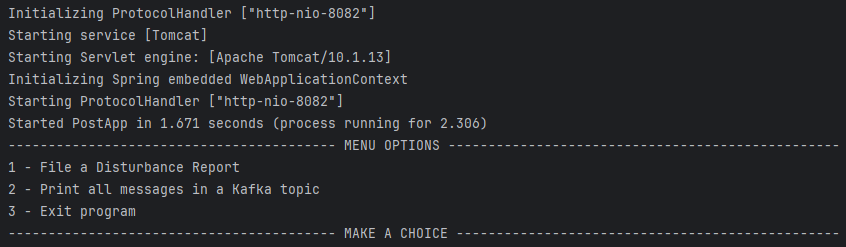

## **Johan's Disturbance Reporter**

---
### Description
My motivation for creating this application was due to the fact that I think the time it takes to file a disturbance report, if your neighbours are making too much noise, is too long.  
With minimal effort, the user is able to file a report and send it to the landlord, who's then able to view the report and take immediate action.
 Integrating Apache Kafka in this application, the report is directly sent to the landlords database, preventing middlemen to interfere and causing delays in the process.
 I learned a great deal about the importance of integrating Apache Kafka in applications, not only to improve the user experience, but more importantly, to improve the application's efficiency.

---
### Table of Contents
+ [Installation](#installation)
+ [Usage](#usage)
+ [Credits](#credits)
+ [Dependencies](#dependencies)
+ [License](#license)
+ [Link to Documentation](SpringBoot-ApacheKafka-Project/Installation&Documentation/Documentation.md)
+ [Tests](#tests)

---
### Installation
*Before you run the application, do the following:*
+ Make sure you have an IDE installed, such as [IntelliJ IDEA](https://www.jetbrains.com/idea/download/#section=windows) and [JDK 21](https://www.oracle.com/se/java/technologies/downloads/).
+ [Apache Kafka](https://www.apache.org/dyn/closer.cgi?path=/kafka/3.5.0/kafka_2.13-3.5.0.tgz) - Download the latest version of Apache Kafka and extract the files to a directory of your choice.
+ [MongoDB Community Server](https://www.mongodb.com/try/download/community) - Download the latest version of MongoDB and install it. Make sure to install the MongoDB Compass as well, when asked by the installation wizard.
+ Clone this GitHub repository to your computer.
+ This application uses 3 separate Kafka Brokers. To set this up, do the following:
  + Head over to your Apache Kafka directory's config folder and make 3 copies of "server.properties" and rename them to "server1.properties", "server2.properties" and "server3.properties", or whatever you prefer. 
  + After you've done that, head over to this SpringBoot-ApacheKafka-Project/Installation&Documentation/Brokers Config and copy-paste the content to each broker you just created.
---
### Usage (For Windows)
*To run the application, do the following:*
+ Open the directory where you extracted the Apache Kafka files and run the following commands in the terminal:
    + (ZooKeeper) - `.\bin\windows\zookeeper-server-start.bat .\config\zookeeper.properties`
    + (Broker) - `.\bin\windows\kafka-server-start.bat .\config\server.properties` (Repeat this command for each broker you created previously)
+ Open your MongoDB Compass and click on the green "Connect" button. This will connect you to your localhost MongoDB.
+ Open this project in your IntelliJ IDEA and head over to the "Services"-tab located in the bottom-left corner. You should see the following:
 
+ Either right-click on Spring Boot and click on "Run" or manually run the following applications in the following order:
    + ProducerApp
    + PostApp
    + ConsumerApp
+ If your settings are correct, you should be able to left-click on the "PostApp"-service and see the following:
 

---
### Credits
+ [ChatGPT 3.5](https://chat.openai.com/) - For answering my questions when brain fog was present. For documenting the code.
+ [Emil Sivertsson](https://github.com/Emilsivertsson) - For being a supportive colleague and helping me with unclear questions regarding POST-requests, Module hassles and more.
+ [Kristoffer Larsson](https://github.com/KoffaRn) - For being a supportive colleague and helping me with unclear questions regarding Module hassles, (de)serialization, code reviews and more.

---
### Dependencies
+ [Spring Boot Starter Web 3.1.4](https://mvnrepository.com/artifact/org.springframework.boot/spring-boot-starter-web/3.1.4)
+ [Spring Kafka 3.0.11](https://mvnrepository.com/artifact/org.springframework.kafka/spring-kafka/3.0.11)
+ [Lombok 1.18.30](https://mvnrepository.com/artifact/org.projectlombok/lombok/1.18.30)
+ [Spring Boot Starter Test 3.1.4](https://mvnrepository.com/artifact/org.springframework.boot/spring-boot-starter-test/3.1.4)
+ [Spring Boot Kafka Test 3.0.11](https://mvnrepository.com/artifact/org.springframework.kafka/spring-kafka-test/3.0.11)
+ [Spring Boot Starter Data MongoDB 3.1.4](https://mvnrepository.com/artifact/org.springframework.boot/spring-boot-starter-data-mongodb/3.1.4)
+ [Mongo Driver Sync 4.10.2](https://mvnrepository.com/artifact/org.mongodb/mongodb-driver-sync)
+ [Mongo Driver Core 4.10.2](https://mvnrepository.com/artifact/org.mongodb/mongodb-driver-core)
+ [Logback Classic 1.4.11](https://mvnrepository.com/artifact/ch.qos.logback/logback-classic/1.4.11)
+ [Apache Http Client5 5.2.1](https://mvnrepository.com/artifact/org.apache.httpcomponents.client5/httpclient5)

---
### License
[Apache License 2.0](LICENSE)

---
### Tests
The following classes have been tested:
+ [MongoConsumerTest](SpringBoot-ApacheKafka-Project/KafkaMongoConsumer/src/test/java/com/consumer/MongoConsumerTest.java)
  + Tests written by myself, Johan Romeo.
+ [KafkaProducerTest](SpringBoot-ApacheKafka-Project/KafkaProducer/src/test/java/com/producer/KafkaProducerTest.java)
  + Tests automatically generated by Diffblue Cover. 
+ [RestControllerTest](SpringBoot-ApacheKafka-Project/KafkaProducer/src/test/java/com/producer/RestControllerTest.java)
  + Tests automatically generated by Diffblue Cover. 
