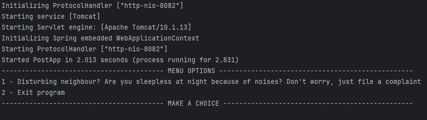

## **Johan's Disturbance Reporter**

---
### Description
My motivation for creating this application was due to the fact that I think the time it takes to file a disturbance report, if your neighbours are making too much noise, is too long.  
With minimal effort, the user is able to file a report and send it to the landlord, who's then able to view the report and take immediate action.
 Integrating Apache Kafka in this application, the report is directly sent to the landlords database, preventing middlemen to interfere and causing delays in the process.
 I learned a great deal about the importance of integrating Apache Kafka in applications, not only to improve the user experience, but more importantly, to improve the application's efficiency.

---
### Table of Contents
+ [Installation](#installation)
+ [Usage](#usage)
+ [Credits](#credits)
+ [Dependencies](#dependencies)
+ [License](#license)

---
### Installation
*Before you run the application, do the following:*
+ Make sure you have an IDE installed, such as [IntelliJ IDEA](https://www.jetbrains.com/idea/download/#section=windows) and [JDK 21](https://www.oracle.com/se/java/technologies/downloads/).
+ [Apache Kafka](https://www.apache.org/dyn/closer.cgi?path=/kafka/3.5.0/kafka_2.13-3.5.0.tgz) - Download the latest version of Apache Kafka and extract the files to a directory of your choice.
+ [MongoDB Community Server](https://www.mongodb.com/try/download/community) - Download the latest version of MongoDB and install it. Make sure to install the MongoDB Compass as well, when asked by the installation wizard.
+ Clone this GitHub repository to your computer.
---
### Usage (For Windows)
*To run the application, do the following:*
+ Open the directory where you extracted the Apache Kafka files and run the following commands in the terminal:
    + `bin/zookeeper-server-start.bat config/zookeeper.properties`
    + `bin/kafka-server-start.bat config/server.properties` (*Optional: To set up more Brokers, create 3 different copies of "server.properties" and change their name to your befitting. Head over to this project's \Installation & Documentat\Broker Config-folder and copy the content, one for each new Broker*)
+ Open your MongoDB Compass and create a new database called "disturbance-reporter".
+ Open this project in your IntelliJ IDEA and head over to the "Services"-tab located on the bottom-left corner. You should see the following:

+ Either right-click on Spring Boot and click on "Run" or manually run the following applications in the following order:
    + ProducerApp
    + PostApp
    + ConsumerApp
+ If your settings are correct, you should be able to left-click on the "PostApp"-service and see the following:
+ 

---
### Credits
+ [ChatGPT 3.5](https://chat.openai.com/) - For asking questions and getting answers.
+ [Emil Sivertsson](https://github.com/Emilsivertsson) - For being a supportive colleague and helping me with unclear questions regarding POST-requests, Module hassles and more.
+ [Kristoffer Larsson](https://github.com/KoffaRn) - For being a supportive colleague and helping me with unclear questions regarding Module hassles, (de)serialization, code reviews and more.

---
### Dependencies
+ [Spring Boot Starter Web -> 3.1.4](https://mvnrepository.com/artifact/org.springframework.boot/spring-boot-starter-web/3.1.4)
+ [Spring Kafka]()